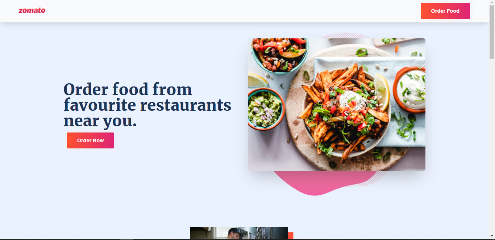

# Zomato | Landing Page

## Hello, everyone! 👋

Thank you for visiting this front-end page. Above image is a small preview for this landing page, you can check the full page by clicking on the link mentioned below. 

## About this project ✅

Users can be able to:

- View the optimal layout for the site depending on their device's screen size
- See hover states for all interactive elements on the page

## Page Link 🔗

- Solution URL: []

## Built with 🏨

- Semantic HTML5 markup
- CSS custom properties
- Flexbox
- Mobile-first workflow

## Connect with me 💙

- [Frontend Mentor](https://www.frontendmentor.io/profile/Ganeshkumar22)
- [LinkedIn](https://www.linkedin.com/in/ganeshkumar-s-n-68a924209/)
- [Twitter](https://twitter.com/Ganeshkumar_22)
- [Instagram](https://www.instagram.com/__gk22__/)